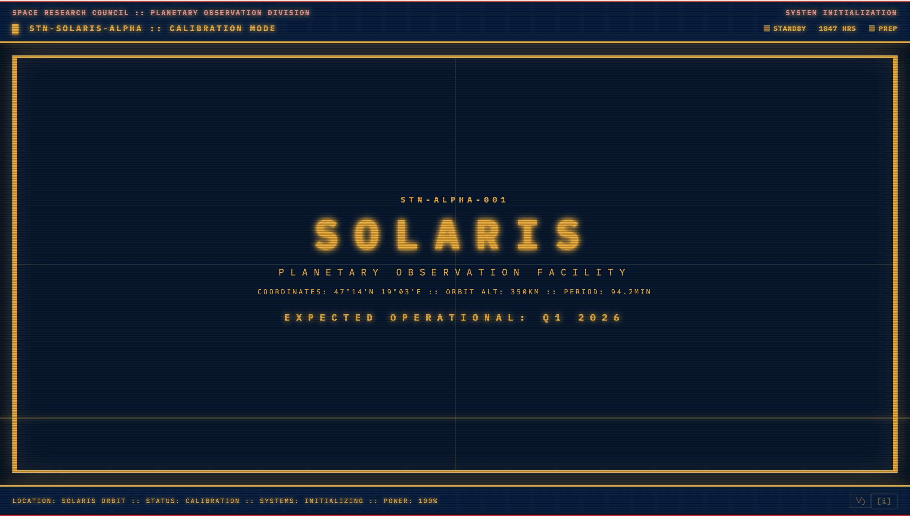

# Solaris Observer

A coming soon page for Solaris.



🔗 **Live Site:** [solaris.observer](https://solaris.observer)

## About

This is a temporary pre-launch landing page. The page features a retro CRT terminal aesthetic reminiscent of Soviet-era research stations.

Expected launch: **Q1 2026**

## Tech Stack

- Pure HTML/CSS/JavaScript
- No frameworks or dependencies
- Hosted on GitHub Pages
- Custom domain via Cloudflare

## Project Structure

```
.
├── index.html          # Main page
├── styles.css          # CRT terminal styling & animations
├── script.js           # Typewriter effect & time updates
├── robots.txt          # Search engine directives
├── sitemap.xml         # Site map for SEO
└── CNAME              # Custom domain configuration
```

## License

© 2025 Magdalena Hamilton. All rights reserved.

## Contact

- Website: [magdahamilton.dev](https://magdahamilton.dev)
- Email: hi@magdahamilton.dev
